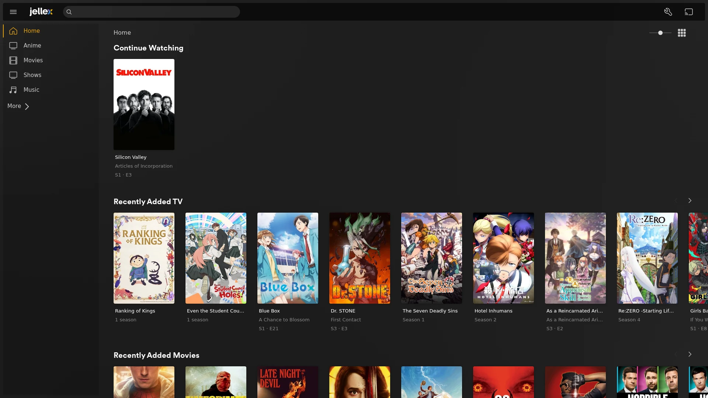

<h1 align="center">
  <picture>
    <source media="(prefers-color-scheme: dark)" srcset="assets/wordmark.svg">
    
  </picture>
</h1>

<h1 align="center"><a href="https://jellex.x86.cx">jellex.x86.cx</a></h1>

A Plex Web-style client for [Jellyfin](https://jellyfin.org).

> [!NOTE]
> jellex was written entirely by an LLM (Claude) in directed sessions.

jellex is a single-page app that talks to the Jellyfin API directly from the
browser: there is no backend to run. It deploys to Cloudflare Workers; point
it at your server and sign in.



## Development

```sh
npm install
npm run dev
```

Then open http://localhost:32400 and sign in to your Jellyfin, or use "Try
the Jellyfin demo" to sign in to Jellyfin's public demo server.
`npm run build` builds it, and `npx wrangler deploy` deploys it
(`wrangler.jsonc`). See
[AGENTS.md](AGENTS.md) for more.
